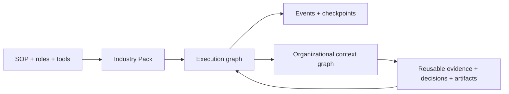

# Graph Native Workbench

**Turn an SOP into an executable, inspectable work graph — then preserve its
evidence, decisions and deliverables as organizational context.**

[中文说明](README.zh-CN.md) · `0.2.1` public alpha · MIT licensed

Graph Native Workbench is an open-source foundation for complex industry work.
It connects an **execution graph** (agents, functions, tools, humans and quality
gates) to a durable **context graph** (sources, evidence, artifacts, versions
and decisions). Teams ship their own domain behavior as installable Industry
Packs without forking the kernel.




## See it work

Requires Node.js 24+ and pnpm. No account, database or model key is required.

```bash
pnpm dlx graphwork
```

This starts the local Workbench, opens it in your browser and stores the
workspace under `.graphwork` in the current directory. Run the complete
zero-key workflow in the terminal instead:

```bash
pnpm dlx graphwork demo
```

For development from source:

```bash
pnpm install
pnpm demo
```

The demo runs two evidence branches in parallel, joins them, checks quality,
passes a human approval gate, publishes a deliverable and projects the result
into 7 typed context objects connected by 9 provenance-linked relations.

Pause at the human gate instead:

```bash
pnpm dlx graphwork demo --pause
```

## Three installable examples

From **Packs**, a workflow installs into the same editor, runtime, approval
inbox, deliverable console and context explorer:


| Industry Pack | What it produces | Why it matters |
| --- | --- | --- |
| Customer Success Renewal | An approved renewal-risk assessment and owned success plan | Shows a common enterprise SOP becoming a complete workbench without kernel changes |
| Architecture Concept Design | A source-linked concept brief with reviewed design directions | Proves a deep vertical can keep evidence, constraints and decisions traceable |
| Cross-industry Research | An approved evidence synthesis | Keeps the first run zero-key and easy to inspect |

### One run, end to end

| Human checkpoint | Approved deliverable | Reusable context |
| --- | --- | --- |
|  |  |  |

Run the customer-success case from source:

```bash
pnpm graphwork pack demo packs/customer-success/src/index.ts --fixture enterprise_renewal
```

It analyzes product and stakeholder signals in parallel, scores renewal risk,
creates accountable interventions, pauses for revenue-owner review, publishes
the plan and confirms the evidence, decision and deliverable in the context
graph. Read the [end-to-end industry case](docs/CUSTOMER_SUCCESS_CASE.md).

## Use the Workbench

Start the local API and React interface together:

```bash
pnpm workbench
```

Open `http://127.0.0.1:4311`. The Workbench is a visual editor over the same
versioned contracts used by the compiler and runtime:

1. Install and open a bundled Industry Pack from **Packs**.
2. Drag nodes onto the canvas, connect or delete them, and edit their handlers,
   state access and execution policies in the inspector.
3. Load a Pack fixture or edit graph input from the **Input** inspector.
4. Run the saved graph, inspect its ordered event stream, and approve or reject
   human checkpoints or policy-gated tool calls.
5. Open **Runs** to revisit execution history and **Context** to inspect the
   confirmed objects, relations and provenance produced by approved work.
6. Open **Packs**, choose **Import .gpack**, review compatibility, permissions
   and the SHA-256 fingerprint, then explicitly trust and install the artifact.

Open **Models** to keep the built-in zero-key runtime or connect OpenAI,
Anthropic Claude, Google Gemini, DeepSeek, Alibaba Qwen, Moonshot Kimi,
xAI Grok, Mistral AI, Groq, OpenRouter, Ollama or a custom OpenAI-compatible
endpoint.
Model identifiers and compatible base URLs remain editable. API keys are read
only from server environment variables; they are never sent to the browser or
stored in the workspace.

Graph drafts, installed Packs, active Pack selection, runs and checkpoints are
stored locally in `.graphwork/workbench.json`. Architecture, Customer Success
and Research are bundled; trusted `.gpack` artifacts can be imported from the
Packs view or installed through the CLI and are stored under `.graphwork/packs`.

Optional declarative tool policy lives at `.graphwork/policy.json`. Completed
or paused runs can be exported from the run console as portable, integrity-
checked audit bundles for independent verification.

Workspace upgrades are automatic and fail-safe. Opening a legacy v1 workspace
preserves an untouched `workbench.json.v1.backup` before atomically migrating
it to the current format with a stable workspace identity.

## Create an Industry Pack

```bash
pnpm graphwork pack init customer_success
pnpm graphwork pack validate packs/customer_success/src/index.ts
pnpm graphwork pack inspect packs/customer_success/src/index.ts
pnpm graphwork pack test packs/customer_success/src/index.ts
pnpm graphwork pack run packs/customer_success/src/index.ts --set "topic=renewal risk"
pnpm graphwork pack schema industry-pack.schema.json
```

The generated Pack is executable immediately. It declares its ontology, state,
workflow, deliverables, fixtures and handlers through public contracts; it does
not edit the kernel.

Package, install and run the same Pack as a versioned artifact:

```bash
pnpm graphwork pack build packs/customer_success/src/index.ts --output customer_success-0.2.0.gpack
pnpm graphwork pack inspect customer_success-0.2.0.gpack
pnpm graphwork pack install customer_success-0.2.0.gpack --trust
pnpm graphwork pack run customer_success --installed --set "topic=renewal risk"
```

Installed versions live side by side and support explicit activation, rollback
and removal. See the [`.gpack` format and security boundary](docs/PACK_FORMAT.md).

Organizations can publish the same artifacts through an Ed25519-signed HTTPS
Registry. Publisher keys are configured out of band; the signed index binds the
Pack identity, checksum, compatibility and permissions before download:

The public [Graphwork Reference Registry](https://angrykarl.github.io/graph-native-workbench/registry/registry.json)
contains the three bundled examples. Its source-controlled publisher key and
fingerprint are documented in the [Registry publishing guide](docs/REGISTRY_PUBLISHING.md).

```bash
pnpm graphwork pack registry verify https://packs.example.com/registry.json \
  --key acme.release=registry-public.pem
pnpm graphwork pack registry install customer_success@0.2.0 \
  --registry https://packs.example.com/registry.json \
  --key acme.release=registry-public.pem
```

Installed third-party handlers and projectors execute in restricted child
Workers rather than the Workbench process.

To browse verified catalogs in the Workbench, configure Registry URLs and
publisher public-key paths in `.graphwork/trust.json`, restart the Workbench,
then open **Packs → Signed Registries**. See the
[trust configuration and installation flow](docs/TRUST_AND_ISOLATION.md#workbench-registry-catalog).

Run the first deep vertical Pack and its two zero-key golden fixtures:

```bash
pnpm graphwork pack inspect packs/architecture/src/index.ts
pnpm graphwork pack test packs/architecture/src/index.ts
pnpm demo:architecture
```

Persist and resume a human-gated run:

```bash
pnpm graphwork pack run packs/research/src/index.ts --set "goal=Evaluate a workflow" --database runs.sqlite
pnpm graphwork pack resume packs/research/src/index.ts --run <run-id> --database runs.sqlite --decision approval=true
```

For team execution, point the same commands at PostgreSQL and run one or more
workers. Queue leases, heartbeats and retries are durable; graph checkpoints
remain the source of recovery:

```bash
graphwork worker start research --installed --database "$GRAPHWORK_POSTGRES_URL" --concurrency 4
graphwork pack enqueue research --installed --database "$GRAPHWORK_POSTGRES_URL" --set "goal=Review a workflow"
```

## Why two graphs?

Most Agent frameworks stop after a run. Industry work cannot: teams need to know
which source supported a claim, who approved a decision, which artifact is
current and which run produced it. Execution graphs coordinate work; context
graphs make the work accountable and reusable.

The kernel generalizes mechanisms. Industry Packs own business semantics.

- The kernel knows graphs, runs, state permissions, events and provenance.
- A Pack supplies ontology, roles, tools, workflows, evaluations, deliverables
  and golden fixtures.
- Agent SDKs, databases and model vendors are adapters—not public Pack contracts.
- A single Agent loop remains valid; complexity must earn its place.

## Repository

```text
packages/contracts   Serializable execution, context and Pack contracts
packages/core        Compiler, runtime and memory/SQLite/PostgreSQL stores
packages/pack-sdk    authoring, packaging, integrity and lifecycle SDK
packs/architecture   Evidence-backed concept design Industry Pack
packs/customer-success Evidence-based renewal workflow Industry Pack
packs/research       Zero-key cross-industry reference Pack
apps/cli             graphwork CLI
apps/workbench       Persistent local API and React graph editor
tests                Contract and end-to-end behavior tests
docs                 Charter, authoring guide, ADRs and roadmap
```

See the [reference deployment](docs/DEPLOYMENT.md), [performance budgets](docs/PERFORMANCE.md)
and [trust and isolation boundary](docs/TRUST_AND_ISOLATION.md). Maintainers can
run the complete [release-readiness gate](docs/RELEASE_READINESS.md) locally.

## Current capabilities

- compile-time Pack references, reachability and ontology validation;
- typed state with node-level write permissions;
- parallel ready sets, joins, routers and conditional edges;
- functions, Agent adapters and human pause/resume checkpoints;
- provider-neutral, bounded Agent tool loops across OpenAI-compatible,
  Anthropic Messages and Gemini GenerateContent protocols;
- role-scoped tools, risk authorization and secret-isolated tool adapters;
- run budgets and ordered event traces;
- node retry and timeout policies plus resumable run cancellation;
- SQLite persistence for runs, events and resumable checkpoints;
- versioned context objects and relations with run/node provenance;
- in-memory and SQLite context-store adapters;
- `init`, `validate`, `inspect`, `test`, `build`, `install`, `list`, `activate`,
  `rollback`, `uninstall`, `run` and `resume` Pack CLI commands;
- portable `.gpack` artifacts with engine compatibility, permission metadata,
  SHA-256 integrity and side-by-side installed versions;
- Ed25519-signed HTTPS Registry metadata with expiry and out-of-band publisher
  trust keys;
- restricted child Workers for third-party handlers and context projectors;
- declared deliverables and executable Pack fixtures;
- JSON Schema export for editor integration;
- Windows and Linux CI with a zero-key smoke demo.
- responsive graph editor with node/edge authoring, contract and policy
  inspection, autosaved drafts, undo/redo and real runtime execution;
- local Pack installation and switching for the bundled Architecture,
  Customer Success and Research Packs;
- persisted run history, human checkpoint resume, Markdown deliverables and
  context graph provenance exploration.

Read the [Product Charter](docs/PRODUCT_CHARTER.md),
[Why execution and context graphs must connect](docs/WHY_TWO_GRAPHS.md),
[Pack Authoring Guide](docs/PACK_AUTHORING.md),
[Extension points](docs/EXTENSION_POINTS.md),
[`.gpack` Package Format](docs/PACK_FORMAT.md),
[Registry Trust and Worker Isolation](docs/TRUST_AND_ISOLATION.md),
[Registry Publishing Guide](docs/REGISTRY_PUBLISHING.md),
[npm Distribution Guide](docs/NPM_DISTRIBUTION.md),
[Architecture Pack](docs/ARCHITECTURE_PACK.md),
[Runtime Adapter Guide](docs/RUNTIME_ADAPTERS.md),
[Roadmap](ROADMAP.md) and [release process](docs/RELEASE_PROCESS.md).

## Contributing

Early contributors can shape the public contract before 1.0. Start with
[CONTRIBUTING.md](CONTRIBUTING.md), or propose a Pack through the issue template.
Please also read the [Code of Conduct](CODE_OF_CONDUCT.md) and
[Security Policy](SECURITY.md).

Graph Native Workbench is available under the [MIT License](LICENSE).
