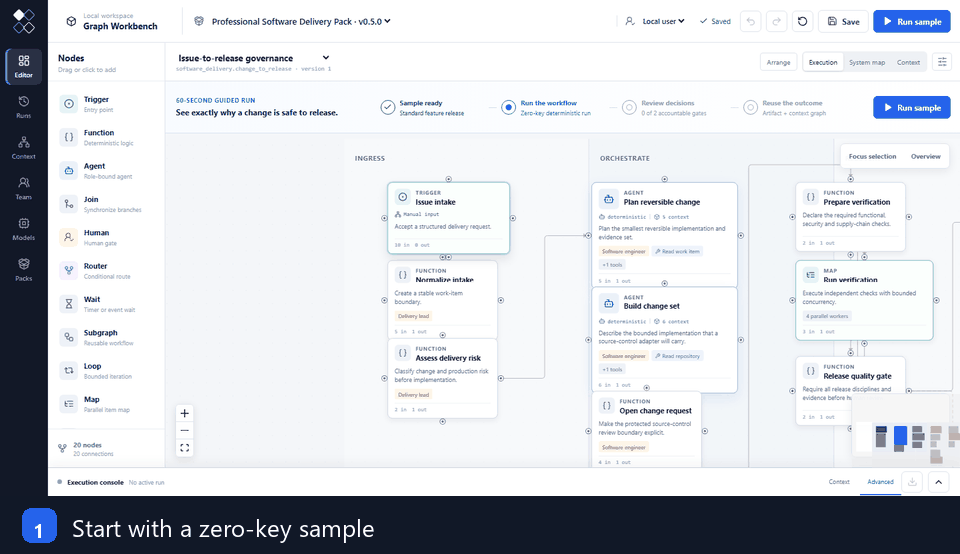
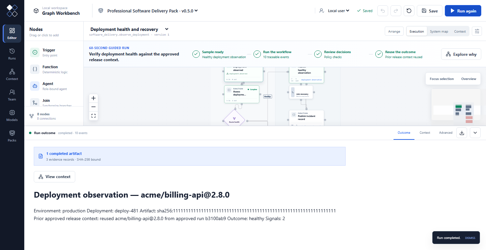
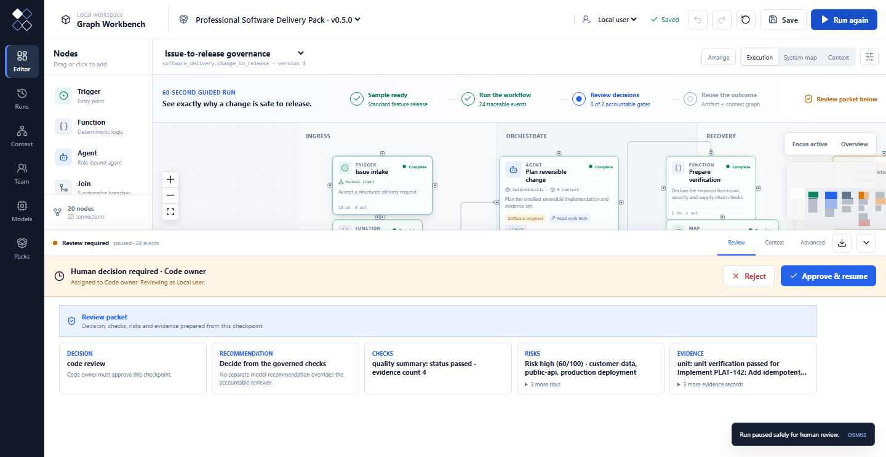
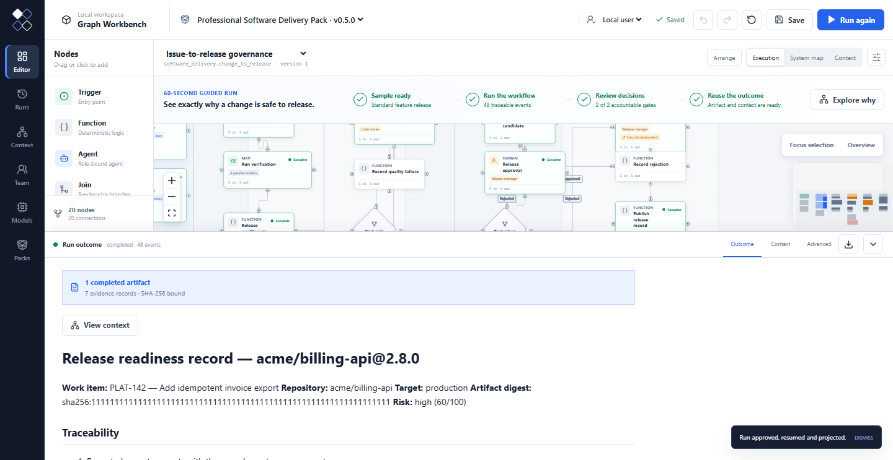
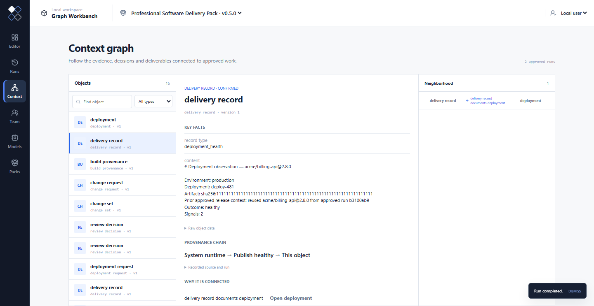
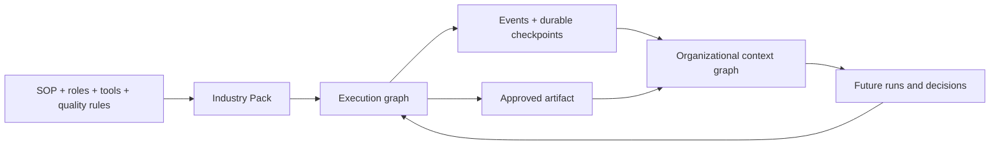

# Graph Workbench

**Govern a software change from issue to release—and preserve why it was approved.**

[](https://github.com/AngryKarl/graph-workbench/actions/workflows/ci.yml)
[](https://www.npmjs.com/package/graph-workbench)
[](LICENSE)
[](package.json)
[](docs/PACK_GALLERY.md)

[简体中文](README.zh-CN.md) · [Pack Gallery](docs/PACK_GALLERY.md) · [Why two graphs?](docs/WHY_TWO_GRAPHS.md) · [Roadmap](ROADMAP.md)

Graph Workbench is an open-source, graph-native workbench for complex industry
work. Its flagship journey turns a software issue into a governed release through
parallel verification, accountable human gates, recovery paths and a portable
release record. The same runtime can install complete operating models as
**Industry Packs**.

Requires Node.js 24+.

```bash
npx graph-workbench
```

No account, database or model key is required. A fresh workspace opens
**Professional Software Delivery** with the **Standard feature release** fixture
ready. Follow the 60-second guided run, approve the code-owner and release-manager
gates, inspect the artifact under **Outcome**, then select **Explore why** for its
connected context.



### One run, two connected graphs

The **execution graph** coordinates Agents, deterministic functions, typed tools,
human decisions and recovery. Once approved, the **context graph** preserves the
work item, change, verification evidence, decisions, release and provenance as
durable organizational context.

Context is also executable input, not just history. The bundled follow-up flow
reads the approved release created by Run A, uses its object ID, version and
source run while evaluating Run B's deployment health, then links the new
deployment observation back to that release.



```text
Issue → parallel checks → accountable approvals → release artifact
  └──────────────── evidence, decisions and provenance ────────────────→ context
```

The bundled zero-key adapters are deterministic reference implementations. They
make every standard Pack executable without credentials; production teams replace
them with reviewed connectors to systems such as GitHub, CI/CD and observability
while keeping the same Pack contracts and governance path.

To run a terminal-only smoke test instead:

```bash
npx graph-workbench demo
```

The public `0.5.0` alpha includes the six-Pack catalog and Pack system maps. To
work from source:

```bash
git clone https://github.com/AngryKarl/graph-workbench.git
cd graph-workbench
corepack enable
pnpm install
pnpm workbench
```

## What makes it different

Many workflow tools stop when a run finishes. Graph Workbench connects the graph
that performs the work to the graph that preserves what the organization learned.

| A workflow answers | Graph Workbench also preserves |
| --- | --- |
| What runs next? | Why it ran, which policy applied and who approved it |
| What did the Agent produce? | Which sources, tools and decisions made the result valid |
| How does data move? | Versioned objects and relations that survive the run |
| Can I export a flow? | Can I install an entire industry operating model? |

- **Execution graph + context graph** — coordinate work and retain its evidence,
  provenance, versions, decisions and reusable artifacts.
- **Cross-run context reuse** — typed read-only queries let a later node use
  approved objects and relations from prior runs while preserving their source.
- **Real governance** — role-owned human gates, tool-risk approvals, retries,
  durable checkpoints, escalation, compensation and integrity-checked audit bundles.
- **Installable Industry Packs** — ship domain semantics without forking the
  kernel or replacing specialist systems.
- **Provider-neutral Agents** — use the zero-key deterministic runtime or connect
  OpenAI, Anthropic, Gemini, DeepSeek, Qwen, Kimi, Grok, Mistral, Groq,
  OpenRouter, Ollama or an OpenAI-compatible endpoint.

## Create your first Industry Pack

The public CLI also scaffolds a standalone Pack outside this repository:

```bash
npx graph-workbench pack init claims_operations
npx graph-workbench pack test packs/claims_operations/src/index.mjs
npx graph-workbench pack run packs/claims_operations/src/index.mjs --set topic=claim-1042
```

The generated Pack already contains an executable graph, a real handler, a
zero-key fixture, a deliverable and a context projector. No repository clone
or model key is required.

## The same governed loop across industries

The screenshots below follow the flagship Software Delivery journey from an
accountable code-owner decision to a portable release record and the exact
organizational context that explains why it was approved.

| Human decision | Portable deliverable | Durable context graph |
| --- | --- | --- |
|  |  |  |

## Six executable industry Packs

Every standard Pack includes executable reference handlers, typed tools, success
and rejection fixtures, recovery behavior, deliverables and a connected context
projection. They run without external credentials. Their bundled adapters model
the integration boundary; specialist systems retain production execution authority.


| Industry Pack | Representative information flow |
| --- | --- |
| [Professional Software Delivery](docs/PACK_GALLERY.md#professional-software-delivery) | Issue → parallel verification → code/release approvals → deploy → observe or rollback |
| [Data and MLOps Asset Release](docs/PACK_GALLERY.md#data-and-mlops-asset-release) | Partitions → quality and lineage → approval → registry → backfill or recovery |
| [Cybersecurity Incident Response](docs/PACK_GALLERY.md#cybersecurity-incident-response) | Signal → evidence → declare → contain → recover → compensate and learn |
| [Quantitative Finance Governance](docs/PACK_GALLERY.md#quantitative-finance-governance) | Hypothesis → instrument backtests → risk/compliance/execution gates → reconcile fills |
| [Healthcare Diagnostic Coordination](docs/PACK_GALLERY.md#healthcare-diagnostic-coordination) | Consent → parallel advisory analysis → specialist decision → report → safe follow-up |
| [Robotics and Fleet Operations](docs/PACK_GALLERY.md#robotics-and-fleet-operations) | Task → robot bid Map → safety approval → dispatch → telemetry → bounded replan |

[Open the full gallery of executable graphs →](docs/PACK_GALLERY.md)

## Nodes are executable semantics, not canvas decoration

The public graph contract covers:

- **work:** `agent`, `function`, `human`;
- **control:** `router`, `join`, `map`, `loop`, `subgraph`;
- **long-running work:** webhook, schedule and typed-event `trigger`, plus
  durable timer or correlated-event `wait`;
- **recovery:** `escalation` and `compensation`.

Pack validation checks every declared executable node for a real handler binding,
including nodes not reached by a happy-path fixture. Compiler, runtime and Pack
tests cover the behavior behind every node kind. See the
[node runtime conformance matrix](docs/NODE_RUNTIME_CONFORMANCE.md).

## Industry Packs are the extension boundary

An Industry Pack bundles:

1. a domain ontology and context relations;
2. roles and responsibility boundaries;
3. typed query and command tools;
4. one or more execution graphs;
5. quality evaluations and human gates;
6. zero-key golden fixtures;
7. deliverables and a context projector.

Create and validate one without changing the kernel:

```bash
pnpm graph-workbench pack init claims_operations
pnpm graph-workbench pack validate packs/claims_operations/src/index.ts
pnpm graph-workbench pack test packs/claims_operations/src/index.ts
```

Packs can be packaged as integrity-checked `.gpack` artifacts or published
through an Ed25519-signed Registry. Third-party handlers and projectors run in
network-denied, read-only containers by default.

## Architecture



The kernel owns execution, governance, provenance and portable contracts.
Industry Packs own business semantics. GitHub, CI runners, SIEM/EDR, Airflow,
FHIR/PACS, trading systems and robot middleware remain specialist authorities
connected through typed adapters.

For teams, execution and context can use PostgreSQL with durable workers,
leases, heartbeats and resumable checkpoints. Local use defaults to SQLite and
requires no infrastructure.

## Documentation

- [Why execution and context graphs must connect](docs/WHY_TWO_GRAPHS.md)
- [Industry workflow analysis](docs/INDUSTRY_WORKFLOW_ANALYSIS.md)
- [Pack Authoring Guide](docs/PACK_AUTHORING.md)
- [Runtime and trigger adapters](docs/RUNTIME_ADAPTERS.md)
- [Trust, Registry and isolation boundary](docs/TRUST_AND_ISOLATION.md)
- [Reference deployment](docs/DEPLOYMENT.md)
- [Product Charter](docs/PRODUCT_CHARTER.md) and [Roadmap](ROADMAP.md)

## Contributing

Graph Workbench is a young public alpha. The most useful contributions are new
Industry Pack fixtures, connector adapters, validation improvements and evidence
from real operating workflows. Start with [CONTRIBUTING.md](CONTRIBUTING.md) or
an issue labeled [`good first issue`](https://github.com/AngryKarl/graph-workbench/issues?q=is%3Aissue%20state%3Aopen%20label%3A%22good%20first%20issue%22).

If graph-native industry work is a direction you want to see develop, star the
repository and tell us which Industry Pack should come next in
[Discussions](https://github.com/AngryKarl/graph-workbench/discussions).

MIT licensed. See [SECURITY.md](SECURITY.md), [GOVERNANCE.md](GOVERNANCE.md)
and [SUPPORT.md](SUPPORT.md).
