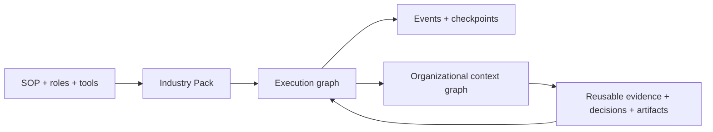

# Graph Native Workbench

**Turn an SOP into an executable, inspectable work graph — then preserve its
evidence, decisions and deliverables as organizational context.**

[中文说明](README.zh-CN.md) · Pre-alpha · MIT licensed

Graph Native Workbench is an open-source foundation for complex industry work.
It connects an **execution graph** (agents, functions, tools, humans and quality
gates) to a durable **context graph** (sources, evidence, artifacts, versions
and decisions). Teams ship their own domain behavior as installable Industry
Packs without forking the kernel.



## See it work

Requires Node.js 24+ and pnpm. No account, database or model key is required.

```bash
pnpm install
pnpm demo
```

The demo runs two evidence branches in parallel, joins them, checks quality,
passes a human approval gate, publishes a deliverable and projects the result
into 7 typed context objects connected by 9 provenance-linked relations.

Pause at the human gate instead:

```bash
pnpm demo:pause
```

## Use the Workbench

Start the local API and React interface together:

```bash
pnpm workbench
```

Open `http://127.0.0.1:4311`. The Workbench loads the Chinese architecture
fixture, lets you edit project facts and located evidence, runs the real
Architecture Pack to its human gate, and records an approval or rejection. An
approved run produces the Markdown brief and projects its sources, findings,
directions, decision and deliverable into the context graph.

## Create an Industry Pack

```bash
pnpm graphwork pack init customer_success
pnpm graphwork pack validate packs/customer_success/src/index.ts
pnpm graphwork pack inspect packs/customer_success/src/index.ts
pnpm graphwork pack test packs/customer_success/src/index.ts
pnpm graphwork pack run packs/customer_success/src/index.ts --set "topic=renewal risk"
pnpm graphwork pack schema industry-pack.schema.json
```

The generated Pack is executable immediately. It declares its ontology, state,
workflow, deliverables, fixtures and handlers through public contracts; it does
not edit the kernel.

Run the first deep vertical Pack and its two zero-key golden fixtures:

```bash
pnpm graphwork pack inspect packs/architecture/src/index.ts
pnpm graphwork pack test packs/architecture/src/index.ts
pnpm demo:architecture
```

Persist and resume a human-gated run:

```bash
pnpm graphwork pack run packs/research/src/index.ts --set "goal=Evaluate a workflow" --database runs.sqlite
pnpm graphwork pack resume packs/research/src/index.ts --run <run-id> --database runs.sqlite --decision approval=true
```

## Why two graphs?

Most Agent frameworks stop after a run. Industry work cannot: teams need to know
which source supported a claim, who approved a decision, which artifact is
current and which run produced it. Execution graphs coordinate work; context
graphs make the work accountable and reusable.

The kernel generalizes mechanisms. Industry Packs own business semantics.

- The kernel knows graphs, runs, state permissions, events and provenance.
- A Pack supplies ontology, roles, tools, workflows, evaluations, deliverables
  and golden fixtures.
- Agent SDKs, databases and model vendors are adapters—not public Pack contracts.
- A single Agent loop remains valid; complexity must earn its place.

## Repository

```text
packages/contracts   Serializable execution, context and Pack contracts
packages/core        Compiler, runtime and memory/SQLite context stores
packages/pack-sdk    define/load/inspect/scaffold developer experience
packs/research       Zero-key cross-industry reference Pack
packs/architecture   Evidence-backed concept design Industry Pack
apps/cli             graphwork CLI
apps/workbench       Local API and React review Workbench
tests                Contract and end-to-end behavior tests
docs                 Charter, authoring guide, ADRs and roadmap
```

## Current capabilities

- compile-time Pack references, reachability and ontology validation;
- typed state with node-level write permissions;
- parallel ready sets, joins, routers and conditional edges;
- functions, Agent adapters and human pause/resume checkpoints;
- role-scoped tools, risk authorization and secret-isolated tool adapters;
- run budgets and ordered event traces;
- node retry and timeout policies plus resumable run cancellation;
- SQLite persistence for runs, events and resumable checkpoints;
- versioned context objects and relations with run/node provenance;
- in-memory and SQLite context-store adapters;
- `init`, `validate`, `inspect`, `test`, `run` and `resume` Pack CLI commands;
- declared deliverables and executable Pack fixtures;
- JSON Schema export for editor integration;
- Windows and Linux CI with a zero-key smoke demo.
- responsive Architecture Pack Workbench with project input, execution trace,
  human review, deliverable preview and provenance inspection.

Read the [Product Charter](docs/PRODUCT_CHARTER.md),
[Pack Authoring Guide](docs/PACK_AUTHORING.md),
[Architecture Pack](docs/ARCHITECTURE_PACK.md),
[Runtime Adapter Guide](docs/RUNTIME_ADAPTERS.md),
[Roadmap](ROADMAP.md) and [release process](docs/RELEASE_PROCESS.md).

## Contributing

Early contributors can shape the public contract before 1.0. Start with
[CONTRIBUTING.md](CONTRIBUTING.md), or propose a Pack through the issue template.
Please also read the [Code of Conduct](CODE_OF_CONDUCT.md) and
[Security Policy](SECURITY.md).

Graph Native Workbench is available under the [MIT License](LICENSE).
