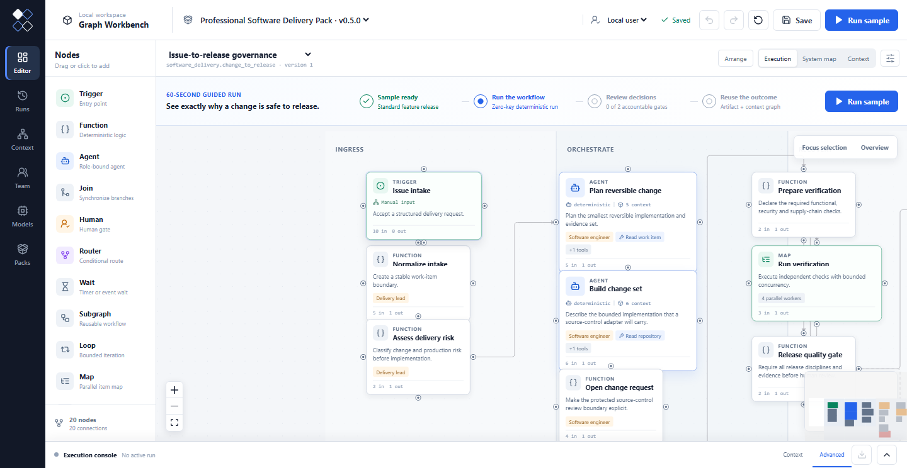
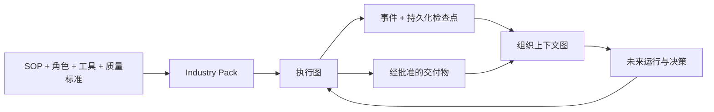

# Graph Workbench

**把软件变更从 Issue 治理到发布，并保留“为什么可以批准”的完整依据。**

[](https://github.com/AngryKarl/graph-workbench/actions/workflows/ci.yml)
[](https://www.npmjs.com/package/graph-workbench)
[](LICENSE)
[](package.json)
[](docs/PACK_GALLERY.md)

[English](README.md) · [Pack 图集](docs/PACK_GALLERY.md) · [为什么需要两张图？](docs/WHY_TWO_GRAPHS.md) · [路线图](ROADMAP.md)

Graph Workbench 是一个面向复杂行业工作的开源 Graph-native Workbench。它的旗舰
体验把软件 Issue 变成经过并行验证、责任人审批和恢复路径治理的发布，并生成可移植
发布记录。同一套运行时可以通过 **Industry Pack** 安装完整的行业工作框架。

需要 Node.js 24+：

```bash
npx graph-workbench
```

不需要账号、数据库或模型密钥。全新工作区会直接打开
**Professional Software Delivery**，并准备好 **Standard feature release** 样例。
跟随 60 秒引导运行，依次批准代码负责人和发布负责人两个关卡，在 **Outcome**
查看交付物，然后选择 **Explore why** 查看相互连接的组织上下文。



### 一次运行，两张相互连接的图

**执行图**协调 Agent、确定性函数、类型化工具、人工决策和恢复路径；工作经过批准后，
**上下文图**会持久保存工作项、变更、验证证据、决策、发布和来源信息。

上下文不只是历史记录，也可以成为后续执行的输入。内置的后续流程会让 Run B
读取 Run A 生成的已批准发布对象，使用其对象 ID、版本和来源运行评估部署健康，
再把新的部署观测连接回该发布。


```text
Issue → 并行检查 → 责任人审批 → 发布交付物
  └────────────── 证据、决策和来源 ──────────────→ 组织上下文
```

内置的零密钥适配器是确定性的参考实现，让所有标准 Pack 无需凭证即可运行。生产团队
需要用经过审查的 GitHub、CI/CD、可观测性等系统连接器替换这些参考适配器，同时保留
相同的 Pack 契约和治理路径。

如果只想在终端运行一次冒烟体验：

```bash
npx graph-workbench demo
```

`0.5.0` 公开 Alpha 已包含六行业 Pack 目录和 Pack System Map。也可以从源码运行：

```bash
git clone https://github.com/AngryKarl/graph-workbench.git
cd graph-workbench
corepack enable
pnpm install
pnpm workbench
```

## 它真正不同在哪里

许多工作流产品在一次运行结束后就停止了。Graph Workbench 把“执行工作的图”
和“保存组织经验的图”连接起来。

| 普通工作流回答 | Graph Workbench 还会保留 |
| --- | --- |
| 下一步运行什么？ | 为什么运行、应用了什么政策、由谁批准 |
| Agent 生成了什么？ | 哪些来源、工具和决策让结果有效 |
| 数据如何流动？ | 跨越单次运行的版本化对象和关系 |
| 能否导出一张流程图？ | 能否安装一整套行业工作框架？ |

- **执行图 + 上下文图**：既协调工作，也保存证据、来源、版本、决策和可复用交付物。
- **跨运行上下文复用**：类型化只读查询允许后续节点使用此前获批的对象与关系，
  同时保留来源运行。
- **真实治理**：角色负责的人工门、工具风险审批、重试、持久化检查点、升级、补偿和完整性审计包。
- **可安装 Industry Pack**：行业语义不需要侵入内核，也不替代专业业务系统。
- **模型中立 Agent**：可以使用零密钥确定性运行时，也可以连接 OpenAI、Anthropic、
  Gemini、DeepSeek、通义千问、Kimi、Grok、Mistral、Groq、OpenRouter、Ollama
  或 OpenAI-compatible 端点。

## 创建你的第一个 Industry Pack

公开 CLI 也可以在本仓库之外直接生成一个独立 Pack：

```bash
npx graph-workbench pack init claims_operations
npx graph-workbench pack test packs/claims_operations/src/index.mjs
npx graph-workbench pack run packs/claims_operations/src/index.mjs --set topic=claim-1042
```

生成结果已经包含可执行图、真实处理器、零密钥样例、交付物和上下文投影器，
不需要克隆本仓库，也不需要模型密钥。

## 同一个治理闭环，适用于不同行业

下面三张图沿着旗舰软件交付旅程展开：从代码负责人作出可追责决策，
到生成可移植的发布记录，再到查看解释“为什么获批”的组织上下文。

| 人工决策 | 可移植交付物 | 持久化上下文图 |
| --- | --- | --- |
|  |  |  |

## 六个可执行的行业 Pack

每个标准 Pack 都包含可执行的参考处理器、类型化工具、成功与拒绝样例、恢复路径、
交付物和相互连接的上下文投影。所有 Pack 都可以零密钥运行；内置适配器负责示范
集成边界，生产执行权仍由专业系统掌握。


| Industry Pack | 代表性信息流 |
| --- | --- |
| [专业软件交付](docs/PACK_GALLERY.md#professional-software-delivery) | Issue → 并行验证 → 代码/发布审批 → 部署 → 观察或回滚 |
| [Data/MLOps 资产发布](docs/PACK_GALLERY.md#data-and-mlops-asset-release) | 分区 → 质量与血缘 → 审批 → 注册 → 回填或恢复 |
| [网络安全事件响应](docs/PACK_GALLERY.md#cybersecurity-incident-response) | 信号 → 证据 → 事件认定 → 遏制 → 恢复 → 补偿和复盘 |
| [量化金融治理](docs/PACK_GALLERY.md#quantitative-finance-governance) | 假设 → 标的回测 → 风控/合规/执行审批 → 成交对账 |
| [医疗诊断协调](docs/PACK_GALLERY.md#healthcare-diagnostic-coordination) | 同意授权 → 并行辅助分析 → 专科决策 → 报告 → 安全随访 |
| [机器人与车队运营](docs/PACK_GALLERY.md#robotics-and-fleet-operations) | 任务 → 机器人竞价 Map → 安全审批 → 调度 → 遥测 → 有界重规划 |

[查看六个 Pack 的真实节点图 →](docs/PACK_GALLERY.md)

## 节点是执行语义，不是画布装饰

公共图契约覆盖：

- **工作节点**：`agent`、`function`、`human`；
- **控制节点**：`router`、`join`、`map`、`loop`、`subgraph`；
- **长流程节点**：Webhook、Schedule、Typed Event `trigger`，以及持久化定时或事件关联 `wait`；
- **恢复节点**：`escalation` 和 `compensation`。

Pack 验证会检查每一个声明的执行节点是否绑定真实处理器，包括正常路径没有经过的节点。
编译器、运行时和 Pack 测试覆盖所有公开节点类型。完整证据见
[节点运行时一致性矩阵](docs/NODE_RUNTIME_CONFORMANCE.md)。

## Industry Pack 是行业扩展边界

一个 Industry Pack 同时封装：

1. 领域对象与上下文关系；
2. 角色与责任边界；
3. 类型化查询和命令工具；
4. 一张或多张执行图；
5. 质量评估与人工检查点；
6. 零密钥黄金样例；
7. 交付物和上下文投影器。

不修改内核就可以创建和验证新 Pack：

```bash
pnpm graph-workbench pack init claims_operations
pnpm graph-workbench pack validate packs/claims_operations/src/index.ts
pnpm graph-workbench pack test packs/claims_operations/src/index.ts
```

Pack 可以构建为带完整性校验的 `.gpack`，也可以通过 Ed25519 签名 Registry
发布。第三方处理器和上下文投影器默认在断网、只读容器中运行。

## 架构



内核负责执行、治理、来源追踪和可移植契约；Industry Pack 负责业务语义。
GitHub、CI Runner、SIEM/EDR、Airflow、FHIR/PACS、交易系统和机器人中间件
仍然是专业执行权威，通过类型化适配器连接。

团队环境可以使用 PostgreSQL、持久化 Worker、任务租约、心跳和可恢复检查点；
本地默认使用 SQLite，不需要部署基础设施。

## 文档

- [为什么执行图和上下文图必须连接](docs/WHY_TWO_GRAPHS.md)
- [六行业工作流分析](docs/INDUSTRY_WORKFLOW_ANALYSIS.md)
- [Pack 开发指南](docs/PACK_AUTHORING.md)
- [运行时与触发器适配](docs/RUNTIME_ADAPTERS.md)
- [Registry、信任和隔离边界](docs/TRUST_AND_ISOLATION.md)
- [参考部署](docs/DEPLOYMENT.md)
- [产品宪章](docs/PRODUCT_CHARTER.md)与[路线图](ROADMAP.md)

## 参与贡献

Graph Workbench 仍处于早期公开 Alpha。当前最有价值的贡献包括行业 Pack 样例、
连接器适配、错误提示改进，以及来自真实工作流的验证证据。可以从
[贡献指南](CONTRIBUTING.md)或带有
[`good first issue`](https://github.com/AngryKarl/graph-workbench/issues?q=is%3Aissue%20state%3Aopen%20label%3A%22good%20first%20issue%22)
标签的任务开始。

如果你也认可 Graph-native Industry Workbench 这个方向，欢迎 Star，并在
[Discussions](https://github.com/AngryKarl/graph-workbench/discussions) 告诉我们下一个应该支持的行业 Pack。

项目采用 MIT License。另见 [安全策略](SECURITY.md)、[治理规则](GOVERNANCE.md)
与[支持渠道](SUPPORT.md)。
