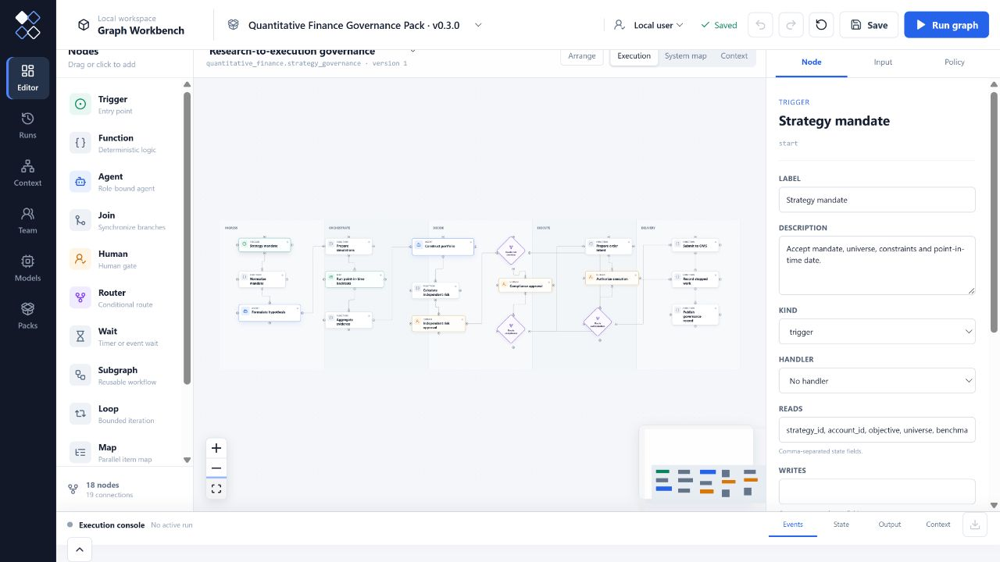
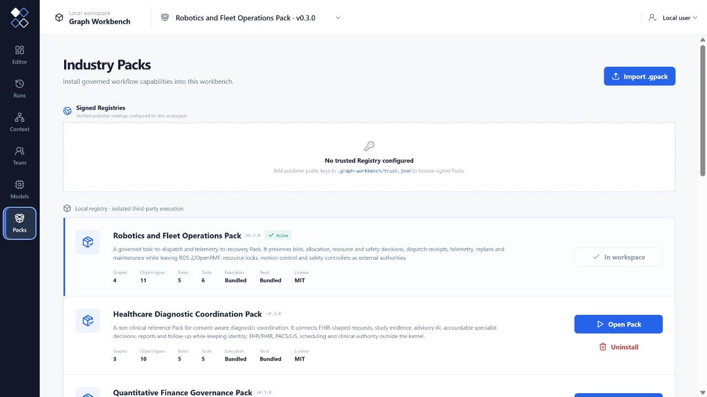

# Graph Workbench

**把企业 SOP 变成可执行、可检查的工作图，再把证据、决策和交付物沉淀为组织上下文。**

[English](README.md) · `0.3.0` 公开 Alpha · MIT

Graph Workbench 是一个面向复杂行业工作的开源 Graph Engineering
框架。它把 Agent 执行图与组织上下文图连接起来，使企业能够把自己的
SOP、角色、工具、知识、质量标准和交付物封装成可安装的 Industry Pack。



## 核心模型

- 执行图负责 Agent、函数、工具、路由、人工审批和质量门。
- 上下文图保存来源、证据、决策、版本和交付物。
- Industry Pack 定义行业对象、角色、工具、工作流和评估标准。
- 内核提供通用执行与治理机制，不包含特定行业语义。

## 快速体验

需要 Node.js 24+ 和 pnpm，不需要账号、数据库或模型密钥：

```bash
pnpm dlx graph-workbench
```

该命令会启动本地 Workbench、自动打开浏览器，并把工作区保存在当前目录的
`.graph-workbench` 下。如果希望直接在终端体验完整的零密钥工作流：

```bash
pnpm dlx graph-workbench demo
```

从 `graphwork@0.2.x` 升级时，第一次启动 `graph-workbench` 会把已有
`.graphwork` 工作区复制到 `.graph-workbench`，且不会删除原目录。迁移期间仍
兼容 `GRAPHWORK_*` 环境变量；新配置应使用 `GRAPH_WORKBENCH_*`。

从源码参与开发：

```bash
pnpm install
pnpm demo
```

Demo 会并行运行两条证据分支，在 Join 节点汇合，通过质量检查和人工审批，
生成最终交付物，并将结果投影成 7 个上下文对象和 9 条带来源关系。

测试人工暂停：

```bash
pnpm dlx graph-workbench demo --pause
```

## 六个标准行业 Pack

在 **Packs** 中安装后，同一个 Industry Pack 会立即获得图编辑器、运行时、
审批入口、交付物控制台和上下文浏览器：



[查看六个第一方 Pack 的真实可执行节点图 →](docs/PACK_GALLERY.md)

| Industry Pack | 直接产出 | 验证重点 |
| --- | --- | --- |
| Professional Software Delivery | 需求到发布的可追溯记录，以及部署健康或回滚证据 | 连接需求、代码、CI/CD 与运维系统，同时不替代这些专业系统 |
| Data and MLOps Asset Release | 经审批的数据/模型注册发布、受控回填记录与质量恢复证据 | 连接编排、目录、血缘和注册系统，同时保留专业系统的执行权威 |
| Cybersecurity Incident Response | 可追溯的信号关闭记录，或经审批的事件响应与恢复记录 | 连接 SIEM、EDR、身份、证据和遏制系统，并明确治理高影响动作 |
| Quantitative Finance Governance | 经独立审批的策略执行意图，以及成交匹配或异常对账记录 | 连接研究、风控、合规、OMS 与账簿系统，但不变成交易引擎 |
| Healthcare Diagnostic Coordination | 经过同意授权和专科医生审批的诊断协调与安全随访记录 | 连接 FHIR/PACS 证据和辅助 AI，同时保留临床决策权 |
| Robotics and Fleet Operations | 经安全审批的调度记录，以及正常或降级任务证据 | 连接竞价、资源、遥测、重规划和维护，但不直接控制机器人 |

### 一次运行的完整结果

| 人工审批 | 经确认的交付物 | 可复用的组织上下文 |
| --- | --- | --- |
|  |  |  |

从源码运行客户成功案例：

```bash
pnpm graph-workbench pack demo packs/customer-success/src/index.ts --fixture enterprise_renewal
```

它会并行分析产品使用与利益相关方信号，评估续约风险，生成带负责人、
期限和成功指标的干预计划，在收入负责人审批后发布交付物，并把证据、
决策和成功计划确认进上下文图。完整过程见
[客户成功行业案例](docs/CUSTOMER_SUCCESS_CASE.md)。

## 使用 Workbench 界面

```bash
pnpm workbench
```

然后打开 `http://127.0.0.1:4311`。界面可以编辑项目目标、场地背景、约束和带
定位的来源证据，也可以直接编辑工作流本身：

1. 在 **Packs** 中安装并打开内置的 Industry Pack。
2. 打开 **System map** 查看 Pack 中的全部工作流、外部入口、复用子图与交付物，
   再从系统图或工作流选择器进入任意一张图。
3. 从左侧节点库拖入节点，在画布上移动、连线或删除节点。
4. 在右侧检查器修改节点名称、处理器、状态读写范围、配置和执行策略。
5. 在 **Input** 中载入 Pack 样例或编辑输入，然后运行经过保存和验证的真实执行图。
6. 审批或拒绝人工检查点与策略要求确认的工具调用，并在底部查看事件、状态、
   Markdown 交付物和上下文摘要。
7. 在 **Runs** 中回看历史运行，在 **Context** 中检查对象、关系和完整来源信息。
8. 在 **Packs** 中选择 **Import .gpack**，检查兼容范围、权限和 SHA-256 指纹后，
   显式信任并安装制品。

打开 **Models** 可以继续使用内置的零密钥运行时，也可以连接 OpenAI、
Anthropic Claude、Google Gemini、DeepSeek、阿里云通义千问、Moonshot Kimi、
xAI Grok、Mistral AI、Groq、OpenRouter、Ollama 或自定义 OpenAI-compatible
端点。模型 ID 可以编辑；带密钥的预设供应商会锁定官方地址，只有自定义或无密钥
供应商可以使用经过审核的兼容端点。API 密钥只从服务端环境变量读取，不会传回
浏览器，也不会写入工作区文件。

模型驱动的 Agent 可以在有界循环中调用 Pack 声明的工具。所有调用继续经过
节点范围、角色权限、风险授权和密钥隔离检查，并作为有序事件显示在运行控制台。

图草稿、已安装 Pack、当前 Pack、运行记录和人工检查点会持久化到本地
`.graph-workbench/workbench.json`。Software Delivery、Data and MLOps、Cybersecurity Incident Response、Quantitative Finance、Healthcare Diagnostics 与 Robotics/Fleet Operations 是六个标准行业 Pack；Architecture、Customer Success 与 Research 也作为开发示例内置。可信的 `.gpack` 可以直接从 Packs 页面导入，也可以通过 CLI 安装，并保存在
`.graph-workbench/packs`。

可选的声明式工具策略位于 `.graph-workbench/policy.json`。暂停或完成的运行可以从控制台
导出为带完整性校验的可移植审计包，并在其他环境独立验证。

Workbench 会自动、安全地升级工作区格式。打开旧版 v1 工作区时，会先保留未经修改的
`workbench.json.v1.backup`，再原子迁移到带稳定工作区标识的当前格式。

## 创建 Industry Pack

```bash
pnpm graph-workbench pack init customer_success
pnpm graph-workbench pack validate packs/customer_success/src/index.ts
pnpm graph-workbench pack inspect packs/customer_success/src/index.ts
pnpm graph-workbench pack test packs/customer_success/src/index.ts
pnpm graph-workbench pack run packs/customer_success/src/index.ts --set "topic=renewal risk"
```

把同一个 Pack 打包、安装并按 ID 运行：

```bash
pnpm graph-workbench pack build packs/customer_success/src/index.ts --output customer_success-0.3.0.gpack
pnpm graph-workbench pack inspect customer_success-0.3.0.gpack
pnpm graph-workbench pack install customer_success-0.3.0.gpack --trust
pnpm graph-workbench pack run customer_success --installed --set "topic=renewal risk"
```

不同版本会并排保存，并支持激活、回滚和卸载。完整协议与安全边界见
[`.gpack` 格式说明](docs/PACK_FORMAT.md)。

组织也可以通过 Ed25519 签名的 HTTPS Registry 发布 Pack。发布者公钥由使用方
独立配置，签名索引会在下载前绑定 Pack 身份、校验和、兼容范围与权限：

公开的 [Graph Workbench Reference Registry](https://angrykarl.github.io/graph-workbench/registry/registry.json)
已经提供六个标准行业 Pack。Architecture、Customer Success 和 Research 仍作为
仓库内的额外开发示例。发布者公钥和指纹见
[Registry 发布指南](docs/REGISTRY_PUBLISHING.md)。

```bash
pnpm graph-workbench pack registry verify https://packs.example.com/registry.json \
  --key acme.release=registry-public.pem
pnpm graph-workbench pack registry install quantitative_finance@0.3.0 \
  --registry https://packs.example.com/registry.json \
  --key acme.release=registry-public.pem
```

安装的第三方 Pack 处理器和上下文投影器默认会在只读、非 root、断网的容器 Worker
中执行，不会加载进 Workbench 主进程。详细边界见
[Registry 信任与 Worker 隔离](docs/TRUST_AND_ISOLATION.md)。

如需在界面中浏览已验签的目录，请在 `.graph-workbench/trust.json` 配置 Registry 地址
和发布者公钥路径，重启 Workbench 后打开 **Packs → Signed Registries**。具体格式见
[Workbench Registry 配置](docs/TRUST_AND_ISOLATION.md#workbench-registry-catalog)。
参考 Registry 的 Pack 构建、签名、验签与 GitHub Pages 发布流程见
[Registry 发布指南](docs/REGISTRY_PUBLISHING.md)。

生成的 Pack 可以立即运行，不需要修改内核。详细内容见
[产品宪章](docs/PRODUCT_CHARTER.md)、[Pack 开发指南](docs/PACK_AUTHORING.md)和
[路线图](ROADMAP.md)。

体验首个深度行业 Pack 及其两组零密钥黄金样例：

```bash
pnpm graph-workbench pack inspect packs/architecture/src/index.ts
pnpm graph-workbench pack test packs/architecture/src/index.ts
pnpm demo:architecture
```

Architecture Pack 会把项目目标、场地条件、约束和来源证据推进为两套概念方向，
经过质量检查与人工评审后生成带来源清单的概念设计简报。

需要保存并恢复人工审批流程时：

```bash
pnpm graph-workbench pack run packs/research/src/index.ts --set "goal=Evaluate a workflow" --database runs.sqlite
pnpm graph-workbench pack resume packs/research/src/index.ts --run <run-id> --database runs.sqlite --decision approval=true
```

团队部署可以让相同命令连接 PostgreSQL，并启动一个或多个 Worker。任务租约、心跳和
重试由数据库持久化，图检查点仍是恢复执行的权威来源：

```bash
graph-workbench worker start research --installed --database "$GRAPH_WORKBENCH_POSTGRES_URL" --concurrency 4
graph-workbench pack enqueue research --installed --database "$GRAPH_WORKBENCH_POSTGRES_URL" --set "goal=Review a workflow"
```

零安装 npm 分发包的构建、完整烟测和发布门禁见
[npm 分发指南](docs/NPM_DISTRIBUTION.md)。

本项目采用 [MIT License](LICENSE)。

生产化入口见[参考部署](docs/DEPLOYMENT.md)、[性能预算](docs/PERFORMANCE.md)与
[信任和隔离边界](docs/TRUST_AND_ISOLATION.md)。
