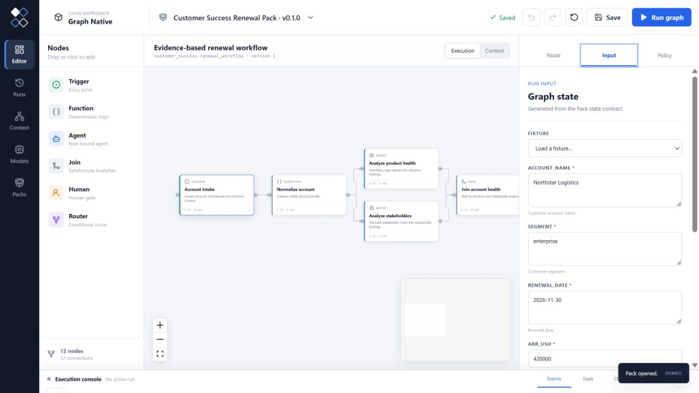
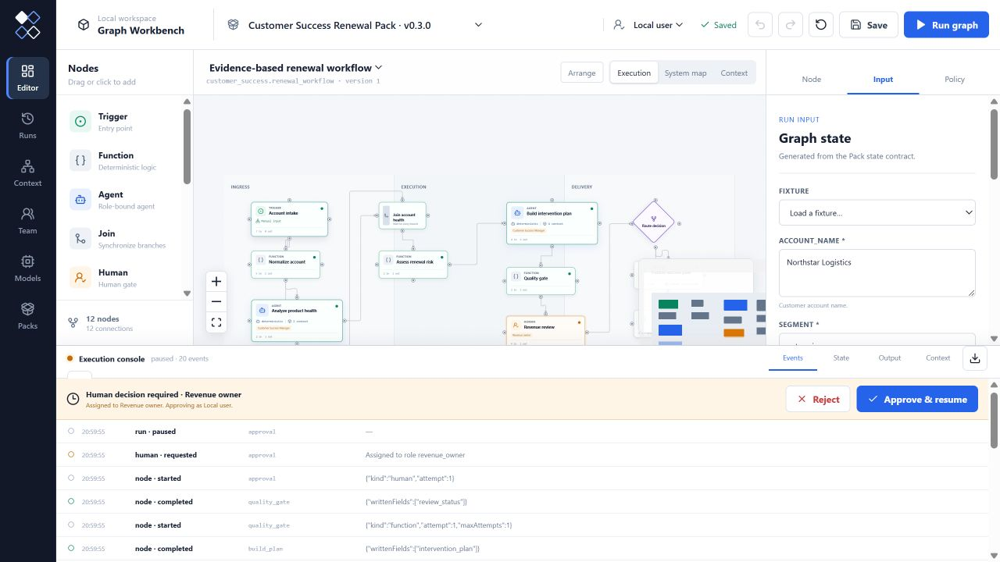
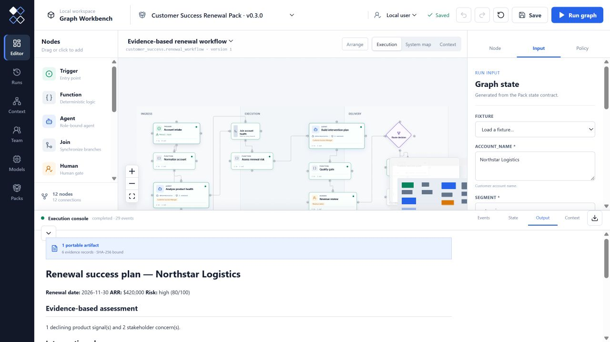
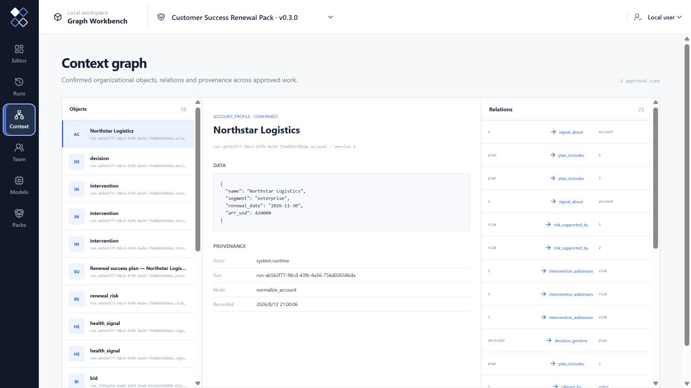

# Industry case: renewal risk to an approved success plan

Northstar Logistics is a fictional enterprise account used to demonstrate a
real customer-success operating pattern without proprietary data. The renewal
is four months away, weekly active teams are declining, the executive sponsor
has left and enablement is behind schedule.

The Customer Success Renewal Pack turns that account evidence into a complete
local workbench rather than a one-off prompt.



## Run the verified fixture

```bash
pnpm graph-workbench pack demo packs/customer-success/src/index.ts \
  --fixture enterprise_renewal
```

The zero-key workflow:

1. normalizes the commercial and outcome context;
2. analyzes product adoption and stakeholder health in parallel;
3. joins both evidence streams into a scored renewal-risk assessment;
4. creates interventions with owners, deadlines and success measures;
5. blocks publication when evidence or actionability is incomplete;
6. pauses for revenue-owner approval;
7. publishes a Markdown renewal success plan;
8. confirms the account, signals, risk, interventions, decision and plan in the
   context graph with provenance.





## Package and install the same workflow

```bash
pnpm graph-workbench pack build packs/customer-success/src/index.ts \
  --output customer_success-0.3.0.gpack
pnpm graph-workbench pack inspect customer_success-0.3.0.gpack
pnpm graph-workbench pack install customer_success-0.3.0.gpack --trust
pnpm graph-workbench workbench
```

Open **Packs**, choose **Customer Success Renewal Pack**, load the
`enterprise_renewal` fixture and select **Run graph**. The installed Pack
supplies the graph canvas, node forms, roles, tools, quality policies, human
gate, deliverable renderer and context explorer. No customer-success code is
added to the Workbench or kernel.

## What becomes reusable context

An approved run projects:

- one account profile;
- attributable product-health signals;
- the scored renewal risk and its evidence links;
- every intervention with its accountable owner;
- the revenue-owner decision;
- the final success plan and the interventions it includes.

A future quarterly review can start from these confirmed objects instead of
reconstructing the account from old prompts and meeting notes. This is the
practical value of connecting the execution graph to the context graph.



The Pack source is under [`packs/customer-success`](../packs/customer-success)
and is released through the same signed Reference Registry as the Research and
Architecture Packs.
