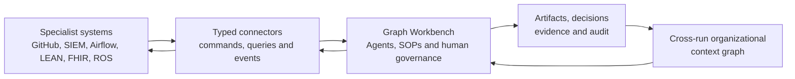

# Industry workflow analysis and platform boundary

This document records the evidence behind the next Graph Workbench milestones.
It is not a market-size estimate. GitHub stars are a directional measure of
open-source developer attention, sampled on 2026-08-10, and should not be read
as adoption, revenue or industry importance.

## Representative open-source attention

| Domain | Representative repositories | Approximate sample stars | Why it is useful to Graph Workbench |
| --- | --- | ---: | --- |
| AI agents and software automation | [n8n](https://github.com/n8n-io/n8n), [OpenHands](https://github.com/All-Hands-AI/OpenHands), [LangGraph](https://github.com/langchain-ai/langgraph) | 323k | Strong demand for visual automation, Agent execution and extensible integrations |
| Quantitative finance | [vn.py](https://github.com/vnpy/vnpy), [LEAN](https://github.com/QuantConnect/Lean), [FinRL](https://github.com/AI4Finance-Foundation/FinRL) | 81k | Clear separation between research, risk approval, execution and reconciliation |
| Data and MLOps | [Airflow](https://github.com/apache/airflow), [Dagster](https://github.com/dagster-io/dagster), [dbt-core](https://github.com/dbt-labs/dbt-core) | 76k | Mature asset, lineage, scheduling, backfill and quality-control concepts |
| Cybersecurity operations | [Nuclei](https://github.com/projectdiscovery/nuclei), [Wazuh](https://github.com/wazuh/wazuh), [Caldera](https://github.com/mitre/caldera) | 54k | Evidence-heavy work with high-risk actions, escalation and audit requirements |
| Robotics and fleet operations | [PX4](https://github.com/PX4/PX4-Autopilot), [ROS 2](https://github.com/ros2/ros2), [OpenRMF](https://github.com/open-rmf/open-rmf) | 19k | Long-running work, resource contention, telemetry and exception-driven replanning |
| Healthcare workflows | [MONAI](https://github.com/Project-MONAI/MONAI), [OHIF](https://github.com/OHIF/Viewers), [Nextflow](https://github.com/nextflow-io/nextflow) | 16k | Strong identity, consent, provenance, specialist review and interoperability needs |

The sample supports a practical ordering rather than a claim that one industry
is more valuable than another. Software delivery, security response and data/AI
release are the best initial Pack targets because their workflows are observable,
their integrations are accessible to open-source contributors, and they exercise
mechanisms that later verticals also need.

## Work and information graphs

### Software delivery

**Work graph:** issue intake -> analysis -> plan -> branch and code -> tests and
scans -> pull request -> review -> merge -> release -> operational feedback.

**Information graph:** Requirement, Issue, Repository, ChangeSet, Test, Finding,
Review, Release and Incident. Pull requests already connect proposed changes,
reviews, checks and merge decisions; Graph Workbench should govern the larger
SOP without replacing the source-control platform.

### Data and MLOps

**Work graph:** schedule or event -> ingest -> validate -> transform -> train or
score -> quality gate -> publish -> record lineage -> monitor -> rerun or backfill.

**Information graph:** Dataset, Schema, Partition, Asset, Model, Metric, Lineage,
SLA and Run. Airflow-style task dependencies and asset-oriented metadata should
arrive through adapters rather than become a second data orchestrator in the core.

### Cybersecurity operations

**Work graph:** signal -> deduplicate and correlate -> enrich -> assign severity ->
declare incident -> approve containment -> eradicate -> recover -> notify -> update
controls and lessons learned.

**Information graph:** Alert, Indicator, Asset, Identity, Evidence, Incident,
ResponseAction, Approval and Control. NIST incident-response guidance and MITRE
ATT&CK provide useful external vocabularies, while each organization keeps its
own thresholds, roles and response policy in a Pack.

### Quantitative finance

**Work graph:** acquire data -> generate signal -> backtest -> validate -> check
risk -> approve compliance -> paper or live execution -> order and fill -> reconcile.

**Information graph:** Signal, Model, Backtest, RiskLimit, Approval, Order, Fill,
Position and Exception. Graph Workbench records the governed research-to-decision
chain; a specialist engine such as LEAN remains responsible for market simulation
and order execution.

### Healthcare diagnostics

**Work graph:** service request -> consent and access check -> schedule -> acquire
image or specimen -> analyze with optional AI assistance -> clinician review ->
diagnostic report -> care plan and follow-up.

**Information graph:** Patient, ServiceRequest, Task, Observation, ImagingStudy,
DiagnosticReport, Consent and Practitioner. Healthcare Packs should map to standards
such as FHIR. The core must not invent a competing clinical record or imaging store.

### Robotics and fleet operations

**Work graph:** task request -> constraints -> bid and allocate -> plan -> reserve
resources -> dispatch -> observe state events -> replan or escalate -> complete ->
maintain.

**Information graph:** Fleet, Robot, Task, Bid, Route, Resource, Battery, Telemetry,
Incident and MaintenanceAction. ROS 2 lifecycle and OpenRMF dispatch remain the
execution authorities; Graph Workbench coordinates accountable human/Agent SOPs
around them.

## Capability assessment

The 0.4 and 0.5 milestones close the mechanism gaps identified in the original
assessment. The remaining question is now domain coverage rather than another
kernel abstraction.

| Cross-industry mechanism | Current support | Standard-Pack verdict |
| --- | --- | --- |
| Directed execution, parallel work, joins and routing | Typed DAG nodes with bounded concurrency | Pass |
| Human gates, retries, timeouts, cancellation and resume | Actor-attributed, role-owned checkpoints plus persisted team identities | Pass |
| Provider-neutral models and governed tools | Typed query/command tools, structured results, risk policy and idempotency | Pass |
| Pack-owned ontology, roles, fixtures, evaluations and deliverables | Portable Artifact/Evidence envelopes with approval and integrity provenance | Pass |
| Run evidence and versioned context projection | Independent SQLite/PostgreSQL context authority with query and traversal | Pass |
| External events and long-running processes | Webhook, schedule, typed event, timer and correlated-event checkpoints | Pass |
| Iterative and dynamic work | Reusable subgraphs, bounded loops and concurrency-limited Map | Pass |
| Operational recovery | Explicit escalation and compensation events preserved in audit bundles | Pass |

### Six-industry readiness review

“Pass” below means the representative governance SOP can be implemented as a
zero-key standard Pack without changing the kernel. It does not mean Graph
Workbench replaces the industry's specialist execution or record system.

| Domain | Typical mechanisms exercised | Readiness | Specialist authority kept outside Graph Workbench |
| --- | --- | --- | --- |
| Software delivery | Typed issue/repository/CI connectors, parallel checks, two human gates, release artifacts, deployment events and rollback | Pass; first standard Pack implemented | Git hosting, CI runners, artifact registry, deployment platform and observability |
| Data and MLOps | Schedule/event ingress, partition Map, bounded backfill, lineage context, quality gate and publication | Pass for a standard Pack | Airflow/Dagster execution, warehouse, feature/model registry and compute plane |
| Cybersecurity operations | Alert correlation, evidence, severity routing, containment approval, escalation and compensation | Pass for a standard Pack | SIEM/EDR, identity authority, forensic store and containment system |
| Quantitative finance | Research subgraphs, dynamic instrument Map, risk/compliance gates, execution events and reconciliation | Pass for a governance Pack | Market data, backtest engine, OMS/EMS, broker and books-and-records system |
| Healthcare diagnostics | Identity-attributed work, consent gate, parallel analysis, specialist approval, FHIR-shaped context and follow-up | Pass for a non-clinical reference Pack; production requires regulated auth and validation | EHR/FHIR server, PACS/LIS, scheduling, clinical decision authority and regulated identity |
| Robotics and fleet operations | Task events, bid Map, bounded replanning, resource decisions, telemetry correlation, escalation and maintenance | Pass for a coordination Pack | ROS 2/OpenRMF, real-time control, safety controller, resource locks and telemetry bus |

The main production gaps are adapter assurance, organization authentication and
industry certification—not missing workflow syntax. Those concerns remain
deployment and integration boundaries until evidence from at least two domains
shows that a reusable kernel mechanism is genuinely absent.

## Platform boundary

Graph Workbench is an industry work control plane above specialist systems.
It connects an Agent/SOP execution graph to an organizational context graph and
governs the evidence, decisions, approvals and artifacts that cross system
boundaries.

The kernel should not replace source control, data orchestration, a SIEM, a
trading engine, a clinical record, PACS or robot middleware. Domain objects,
policies and integration mappings belong in Industry Packs and adapters. A new
core mechanism must be shared by at least two credible domains and must not be
expressible safely in a Pack or adapter.

## Milestone decisions

### 0.4 — organizational context and governed boundaries

0.4 establishes the durable information plane needed by every initial vertical:

1. Aggregate confirmed context across persisted runs and expose it through the
   Workbench API and Context explorer.
2. Add context query and traversal without exposing storage-specific behavior.
3. Add workspace identity, role assignment, approval ownership and an auditable
   actor model.
4. Define typed connector operations with explicit input, output, permissions,
   risk and idempotency metadata.
5. Promote Artifact and Evidence from Pack conventions to validated portable
   contracts where cross-Pack interchange requires it.

The first item is complete when two approved runs from different Packs remain
visible as one context after a Workbench restart, while each object still points
to its producing run and node. Subsequent items require contract tests, a zero-key
reference implementation and migration compatibility.

0.4 now meets those criteria: the Workbench reads an independent SQLite or
PostgreSQL context authority, legacy run snapshots migrate idempotently, team
identities and Pack responsibilities persist in workspace format v3, approvals
carry actor provenance, connector operations are typed and portable artifacts
verify their content and evidence digests.

### 0.5 — durable event-driven orchestration

0.5 extends the execution plane only after the 0.4 ownership and context
contracts stabilize:

1. Webhook, schedule and typed event triggers.
2. Durable wait/timer and event-correlation checkpoints.
3. Reusable subgraphs with explicit state boundaries.
4. Bounded loops and dynamic map execution with declared budgets.
5. Escalation and compensation paths visible in events and audit bundles.

A mechanism is accepted only when demonstrated by at least two of the initial
Industry Packs. Unbounded cycles and hidden background state remain outside the
public contract.

0.5 now meets those acceptance criteria. The Architecture Pack demonstrates a
schema-validated webhook, durable correlated-event wait and resumable subgraph.
The Customer Success Pack demonstrates stable schedule occurrences, bounded
loop preparation, concurrency-limited Map, typed-event ingress and explicit
escalation/compensation. Runtime and Workbench tests verify checkpoint restart,
event and schedule replay protection, audit visibility and the HTTP ingress
paths. Cron evaluation remains an adapter responsibility rather than hidden
kernel state.

## Standard Industry Pack sequence

1. **Professional Software Delivery Pack** — issue-to-release governance and
   deployment recovery. Implemented as the first standard example.
2. **Data/AI Asset Release Pack** — quality gates, lineage, publication and
   controlled backfill.
3. **Security Incident Response Pack** — evidence, approval, containment,
   escalation and recovery.
4. **Quantitative Finance Pack** — governed research, risk, execution and
   reconciliation.
5. **Healthcare Diagnostics Pack** — consent-aware request, analysis, specialist
   review and report coordination.
6. **Robotics and Fleet Operations Pack** — allocation, dispatch, observation,
   bounded replanning and maintenance.

All six are first-party reference implementations. Their fixtures remain
zero-key; production connectors are replaceable adapters over the same contracts.

## External references

- [GitHub: About pull requests](https://docs.github.com/en/pull-requests/get-started/about-pull-requests)
- [Apache Airflow: Tasks](https://airflow.apache.org/docs/apache-airflow/stable/core-concepts/tasks.html)
- [Apache Airflow: DAGs](https://airflow.apache.org/docs/apache-airflow/stable/core-concepts/dags.html)
- [NIST SP 800-61 Revision 3 announcement](https://www.nist.gov/news-events/news/2025/04/nist-revises-sp-800-61-incident-response-recommendations-and-considerations)
- [MITRE ATT&CK tactics](https://attack.mitre.org/tactics/)
- [QuantConnect LEAN algorithm engine](https://www.quantconnect.com/docs/v2/writing-algorithms/key-concepts/algorithm-engine)
- [HL7 FHIR ServiceRequest](https://hl7.org/fhir/servicerequest.html)
- [ROS 2 managed node lifecycle](https://design.ros2.org/articles/node_lifecycle.html)
- [OpenRMF task dispatch](https://github.com/open-rmf/rmf_demos#task-dispatching-in-open-rmf)
- [DORA software delivery performance metrics](https://dora.dev/guides/dora-metrics/)
- [SLSA specification 1.2](https://slsa.dev/spec/v1.2/)
- [GitHub repository rulesets](https://docs.github.com/en/repositories/configuring-branches-and-merges-in-your-repository/managing-rulesets/about-rulesets)
