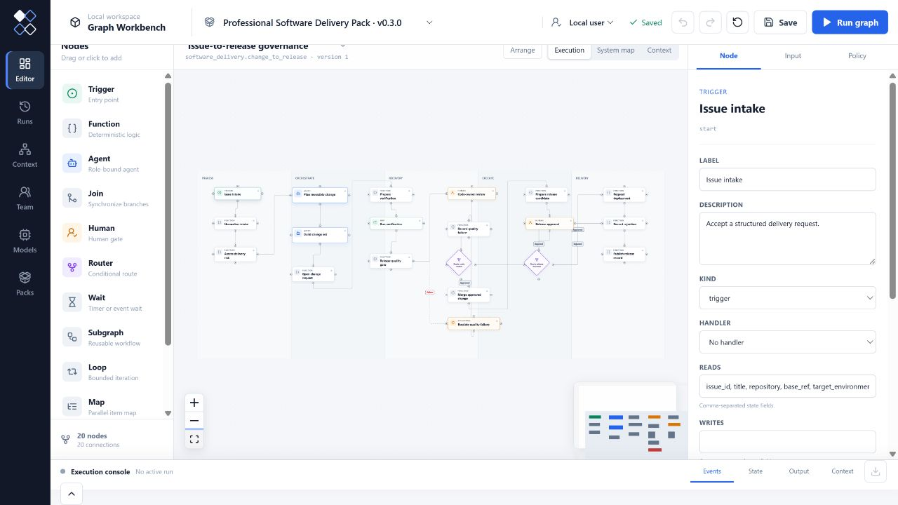
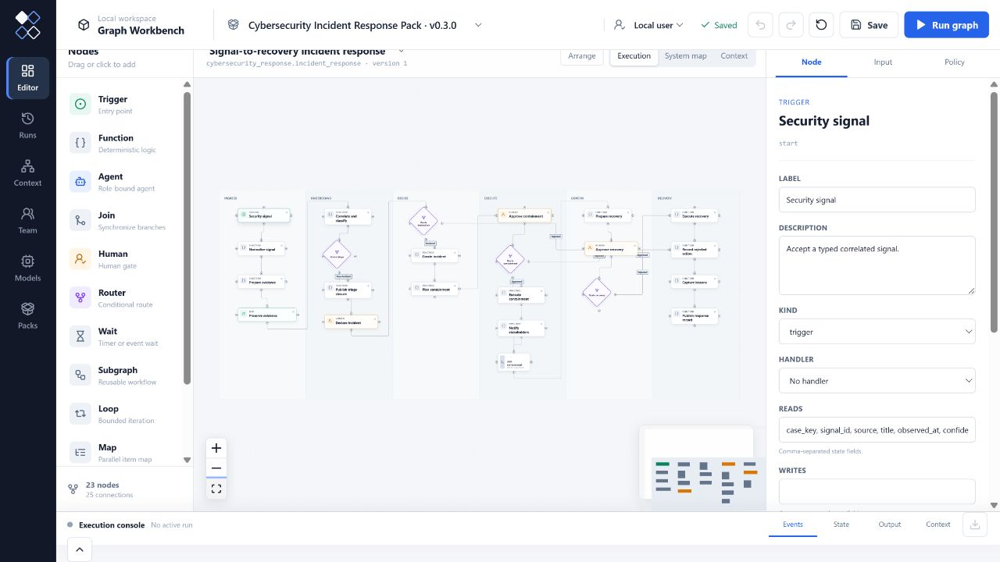
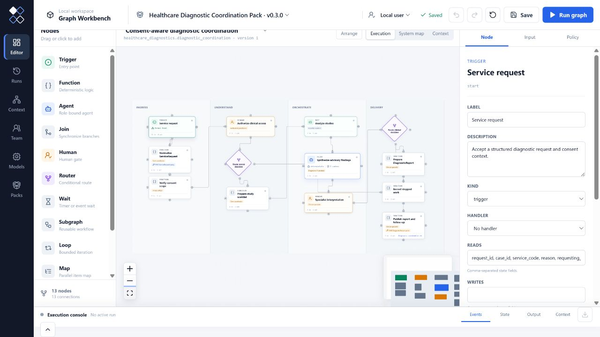
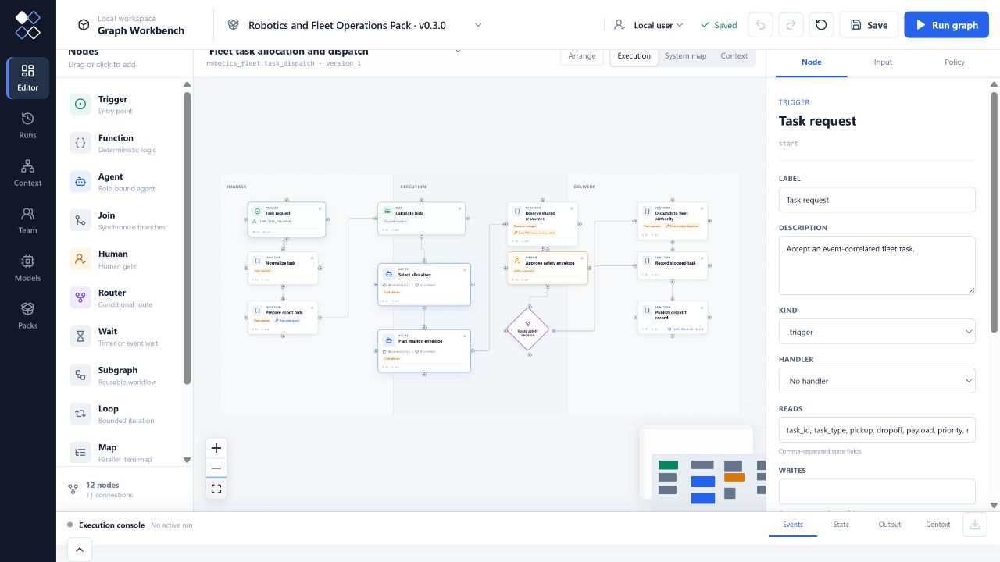

# Industry Pack Gallery

The six standard Industry Packs run in the same Graph Workbench editor,
runtime, approval inbox, deliverable console and context explorer. Each Pack
contains executable success, rejection or recovery fixtures plus a typed
information graph projection. The images below are captured from the real
primary workflow definitions after **Fit View**, not redrawn concept diagrams.

## Professional Software Delivery

Issue intake, change planning, concurrent verification, independent code and
release decisions, immutable deployment request and post-deployment rollback.

## Data and MLOps Asset Release

Partition Map, schema and quality evidence, lineage, independent data/model
approval, registry publication, bounded backfill and quality rollback.

## Cybersecurity Incident Response

Concurrent evidence preservation, incident declaration, containment and
recovery approvals, notification, recovery observation and compensation.

## Quantitative Finance Governance

Falsifiable hypothesis, concurrent instrument backtests, portfolio proposal,
independent risk/compliance/execution gates, OMS intent and fill reconciliation.

## Healthcare Diagnostic Coordination

FHIR-shaped request and consent, parallel advisory study analysis, accountable
specialist interpretation, DiagnosticReport publication and safe follow-up.

## Robotics and Fleet Operations

Event-driven task intake, concurrent robot bidding, resource reservation,
safety approval, external dispatch, telemetry, bounded replanning and maintenance.

Architecture Concept Design, Customer Success Renewal and Cross-industry
Research remain bundled as additional authoring examples. The signed Reference
Registry intentionally publishes the six standard industry Packs above.
