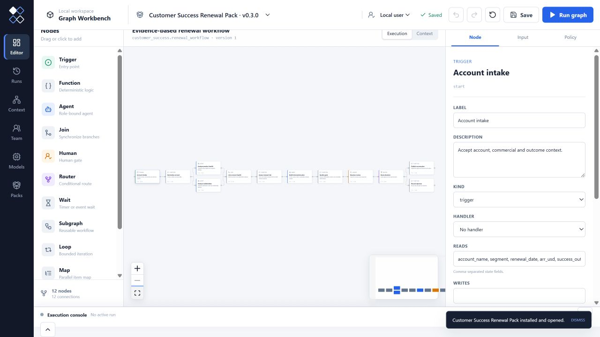

# Industry Pack Gallery

Every first-party Industry Pack runs in the same Graph Workbench editor,
runtime, approval inbox, deliverable console and context explorer. These images
show each Pack's primary execution graph after **Fit View**; they are screenshots
of the executable Pack definitions, not separate concept diagrams.

## Professional Software Delivery

Issue intake, parallel verification, independent release decisions and
post-deployment recovery.

## Data and MLOps Asset Release

Partition quality, lineage, data/model approvals, registry publication and
controlled failure paths.

## Cybersecurity Incident Response

Evidence preservation, incident declaration, approved containment, recovery
and lessons learned.

## Architecture Concept Design

Structured intake, parallel evidence, alternative concepts, quality review and
an approved design brief.

## Customer Success Renewal

Account evidence, health assessment, interventions, revenue-owner approval and
a renewal success plan.

## Cross-industry Research

Parallel evidence collection, synthesis, quality review, approval and
publication.

