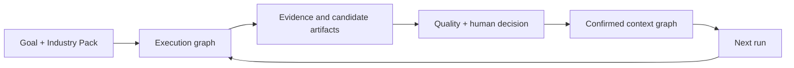

# Why execution graphs and context graphs must connect

Agent workflows are good at answering **what should run next?** Organizations
also need to answer **what is now true, why do we believe it, and which decision
or artifact should future work reuse?** Those are different graph problems.

An execution graph coordinates a run. Its nodes are actions: call a tool,
analyze evidence, join branches, check quality, request approval and publish an
output. Its edges describe control flow. Even a perfect execution trace remains
a history of activity.

A context graph represents organizational state. Its nodes are durable business
objects: sources, requirements, risks, decisions, plans and deliverables. Its
relations explain meaning: evidence supports a claim, a constraint governs a
direction, a decision authorizes a deliverable, and a later plan supersedes an
earlier one.

## What breaks when they are separated

If a workflow keeps only execution history, every later run must reconstruct
business context from logs and chat. The team knows that an Agent ran but not
which result is current or which evidence survived review.

If a knowledge graph has no execution provenance, objects appear without a
reliable account of how they were produced. The team cannot replay the policy,
quality gate or human decision that promoted a draft into confirmed context.

Connecting the graphs closes the loop:

## The projection boundary

Graph Workbench does not copy every runtime value into organizational memory. A Pack
declares a projector that runs only after the workflow reaches an approved
state. The projector converts run state into typed, versioned context objects
and relations. Every confirmed object records the run, node, actor, timestamp
and source identifiers that produced it.

This boundary matters:

- execution state can remain temporary and implementation-oriented;
- organizational context stays typed and domain-oriented;
- rejected or incomplete work does not silently become institutional truth;
- storage engines remain adapters because the contract is independent of a
  particular graph database;
- a Pack can carry the same semantics from a laptop to a team deployment.

## Why Industry Packs are the unit of reuse

The kernel cannot know what “good” means in architecture, customer success or
claims review. An Industry Pack can. It contains the domain ontology, roles,
tools, workflow, quality gates, deliverables, fixtures and context projection
as one installable unit.

The execution/context connection is therefore not an extra analytics feature.
It is what turns an Agent workflow from a disposable run into reusable,
governed organizational work.

See the [dual-graph ADR](architecture/0001-dual-graph-kernel.md) for the formal
decision and the [Customer Success case](CUSTOMER_SUCCESS_CASE.md) for a
concrete end-to-end example.
