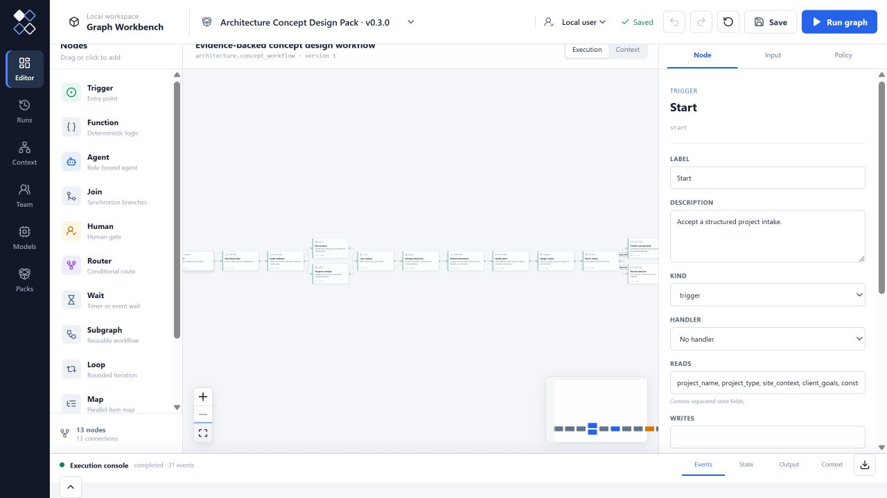

# Architecture Pack

An evidence-backed concept design workflow for Graph Workbench.

The Pack turns a structured project intake into parallel site and program
findings, two distinct concept directions, a quality-gated recommendation, a
human approval checkpoint, and a traceable Markdown concept brief.



From the repository root:

```bash
pnpm graph-workbench pack validate packs/architecture/src/index.ts
pnpm graph-workbench pack inspect packs/architecture/src/index.ts
pnpm graph-workbench pack test packs/architecture/src/index.ts
pnpm demo:architecture
```

The included fixtures are deterministic and require no model key.
