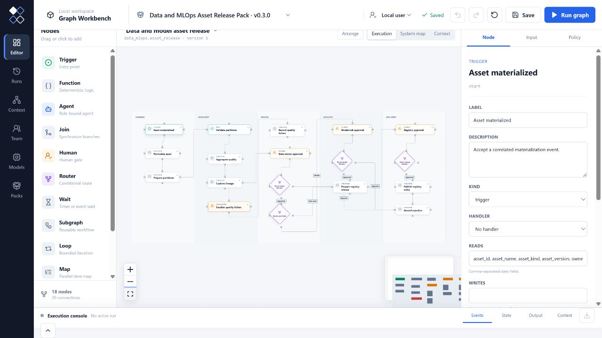

# Data and MLOps Asset Release Pack

This Pack governs the path from a materialized data or model asset to an
approved registry entry, controlled historical reprocessing and post-release
quality recovery. It complements orchestrators, catalogs and model registries;
it does not replace their execution or storage authority.



The reference workflows include:

- schema, completeness and freshness gates across bounded partitions;
- source and transformation lineage attached to an immutable asset version;
- data-product owner and registry-steward approvals;
- an additional independent model-risk gate for model assets;
- explicit backfill range, reprocessing behavior and external concurrency;
- post-release quality events with visible escalation and registry rollback or quarantine;
- typed context objects and relations for every completed release, backfill and incident.

Run every zero-key fixture:

```bash
pnpm graph-workbench pack test packs/data-mlops/src/index.ts
```

Run the dataset release demo:

```bash
pnpm graph-workbench pack demo packs/data-mlops/src/index.ts \
  --fixture daily_customer_dataset
```

The bundled adapters are deterministic reference implementations. Production
teams connect their existing Airflow, Dagster, catalog, lineage or MLflow APIs
while keeping the Pack contract, quality gates, roles and context projection
stable. The Pack records `max_active_runs` as an external-orchestrator policy;
the Graph Workbench Map node independently bounds reference execution.

The backfill contract follows Airflow's current bounded partition/date-range,
reprocessing-behavior and active-run concepts. Model publication uses named
aliases instead of deprecated model stages, matching current MLflow guidance.

References:

- [Apache Airflow backfill](https://airflow.apache.org/docs/apache-airflow/stable/core-concepts/backfill.html)
- [MLflow Model Registry](https://mlflow.org/docs/latest/ml/model-registry/)
- [MLflow model registry workflow and aliases](https://mlflow.org/docs/latest/ml/model-registry/workflow/)
