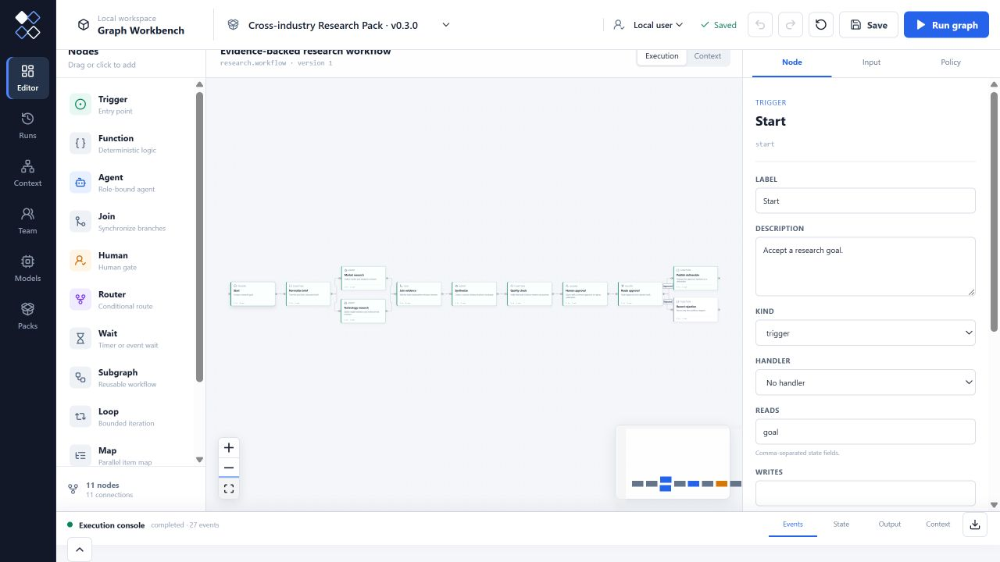

# Cross-industry Research Pack

This zero-key reference Pack demonstrates parallel evidence collection,
synthesis, an explicit quality gate, human approval and a publishable research
deliverable. A configured model can assist synthesis without changing the Pack
contract or evidence boundary.



Run the reference workflow:

```bash
pnpm graph-workbench pack test packs/research/src/index.ts
pnpm graph-workbench pack demo packs/research/src/index.ts
```
